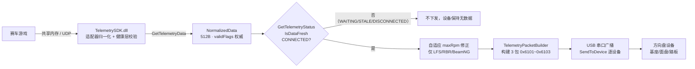
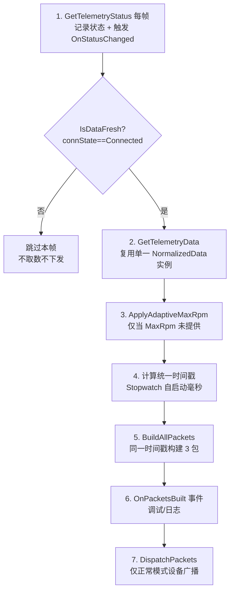

# 遥测数据包字段处理流程技术文档

> 版本：v1.0（对应 TelemetrySDK v1.0.0 + USB 协议 v0.1 第 8 节）
> 日期：2026-09-09
> 适用范围：HITAPEX PC 软件遥测链路 —— SDK `NormalizedData` → 数据处理 → USB 三包（0x6101/0x6102/0x6103）→ 方向盘设备

---

## 1. 概述

### 1.1 文档目的

本文档系统阐述**从 TelemetrySDK 输出的归一化遥测数据（`NormalizedData`，512 字节），经 PC 软件整理处理后，最终下发给设备的 3 个 USB 遥测数据包**中每个字段参数的完整处理流程，包括数据结构、转换规则、特殊字段处理、算法公式、异常值策略与依赖关系。

### 1.2 数据流全景



### 1.3 相关代码文件

| 文件 | 职责 |
|---|---|
| `Services/TelemetryAPI.cs` | P/Invoke 层：`NormalizedData`/`TelemetryStatus` 结构体、`ValidFlags` 常量、`IsDataFresh` 判定 |
| `Services/TelemetryService.cs` | 采集循环：60Hz 轮询、连接状态门控、自适应 maxRpm、时间戳生成、USB 广播 |
| `Services/TelemetryPacketBuilder.cs` | 包构建：SDK 数据 → 3 个 64 字节 USB 数据包 |

---

## 2. 遥测数据包整体结构

### 2.1 包格式总览

每次下发共 **3 个数据包**，每个 **固定 64 字节**，前 7 字节为统一包头：

| 包序号 | 包类型（包头 bytes 1-2） | 内容 |
|---|---|---|
| 包1 | `0x6101` | 基础驾驶参数（车速/转速/档位/踏板/排名/圈速/辅助系统/ERS/涡轮） |
| 包2 | `0x6102` | 胎面三层温度 + 前轮（FL/FR）刹车温度 |
| 包3 | `0x6103` | 胎核温度 + 胎压 + 胎磨损 + 后轮（RL/RR）刹车温度 + 发动机模式 |

### 2.2 包头（所有包共用，7 字节）

| Offset | 长度 | 字段 | 类型 | 说明 |
|---|---|---|---|---|
| 0 | 1 | ID | byte | 固定 `0x61`，遥测数据标识 |
| 1-2 | 2 | 包类型 | uint16 LE | `0x6101` / `0x6102` / `0x6103` |
| 3-6 | 4 | 模拟时间戳 | uint32 LE | 单位 ms，自遥测启动累计（见 8.4） |

### 2.3 数据段划分

- **包头段**：offset 0-6，三包结构一致；
- **驾驶输入段**（包1）：车速、转速、档位、踏板行程；
- **赛事状态段**（包1）：排名、当前/上一/最快圈速；
- **辅助系统段**（包1）：维修区限速器、TC/ABS/DRS 及档位、车轮抱死/打滑、旗语；
- **动力系统段**（包1）：ERS 模式/电量/回收、涡轮压力；
- **轮胎热力段**（包2/包3）：胎面内/中/外温度、胎核温度、胎压、胎磨损、刹车温度；
- **发动机模式段**（包3）：Engine Map 档位。

---

## 3. 包1（0x6101）字段明细

> 转换规则列中 `ValidFlags.XXX` 表示写入前必须检查该有效位；`SDK → 协议` 表示类型/数值映射。

| Offset | 字段 | SDK 来源 | SDK 类型/单位 | 协议类型/单位 | 取值范围 | 转换规则 |
|---|---|---|---|---|---|---|
| 7-10 | 车速 | `speed` | float / km/h | float32 LE / km/h | 恒非负 | 直写（6.1） |
| 11-12 | 最大转速 | `maxRpm` | float / RPM | uint16 LE / RPM | 0-65535 | clamp 取整（6.2） |
| 13-14 | 当前转速 | `rpm` | float / RPM | uint16 LE / RPM | 0-65535 | clamp 取整（6.2） |
| 15 | 档位 | `gear` | int / 语义挡 | byte / 协议编码 | 见 8.1 | 映射表（8.1） |
| 16-19 | 油门行程 | `throttle` | float / 0-1 | float32 LE / 0-1 | 0.0-1.0 | 直写 |
| 20-23 | 刹车行程 | `brake` | float / 0-1 | float32 LE / 0-1 | 0.0-1.0 | 直写 |
| 24-27 | 离合行程 | `clutch` | float / 0-1 | float32 LE / 0-1 | 0.0-1.0 | 直写 |
| 28 | 排名 | `position` | int / 名次 | byte | 0-255 | clamp（6.2） |
| 29-32 | 当前圈速 | `currentLapTime` | float / s | float32 LE / s | 0 或 >0 | 直写（无效值见 9.4） |
| 33-36 | 上一圈速 | `lastLapTime` | float / s | float32 LE / s | 0 或 >0 | 直写 |
| 37-40 | 最快圈速 | `bestLapTime` | float / s | float32 LE / s | 0 或 >0 | 直写 |
| 41 | 维修区限速器 | `isPitLimiterActive` | bool | byte 0/1 | 0/1 | bool→字节（6.3） |
| 42 | TC 激活 | `isTcActive` | bool | byte 0/1 | 0/1 | bool→字节 |
| 43 | ABS 激活 | `isAbsActive` | bool | byte 0/1 | 0/1 | bool→字节 |
| 44 | TC cut 激活 | `tcCutLevel` | int | byte 0/1 | 0/1 | 派生（8.3） |
| 45 | DRS 可用 | `isDrsAvailable` | bool | byte 0/1 | 0/1 | bool→字节 |
| 46 | DRS 激活 | `isDrsActive` | bool | byte 0/1 | 0/1 | bool→字节 |
| 47 | TC 档位 | `tcLevel` | int | byte | 0-255 | clamp |
| 48 | ABS 档位 | `absLevel` | int | byte | 0-255 | clamp |
| 49 | TC cut 档位 | `tcCutLevel` | int | byte | 0-255 | clamp |
| 50 | 车轮抱死 | `isWheelLocked[4]` | bool[4] | byte 位域 | bit0-3 | 位打包（6.5） |
| 51 | 车轮打滑 | `isWheelSlipping[4]` | bool[4] | byte 位域 | bit0-3 | 位打包（6.5） |
| 52-53 | 旗语 | 11×bool | bool×11 | uint16 LE 位域 | bit0-10 | 位打包+重排（8.2） |
| 54 | ERS 模式 | `ersDeployMode` | int | byte | 0-255 | clamp |
| 55-58 | ERS 电量 | `ersCharge` | float / 0-1 | float32 LE / 0-1 | 0.0-1.0 | 直写 |
| 59 | ERS 回收级别 | `ersRecoveryLevel` | int / 0-100 | byte | 0-255 | clamp |
| 60-63 | 涡轮压力 | `turboPressure` | float / bar | float32 LE / bar | 可负 | 直写 |

---

## 4. 包2（0x6102）字段明细

> 轮胎数组顺序固定 `[0]=FL, [1]=FR, [2]=RL, [3]=RR`，与 SDK 一致，**无重排**。

| Offset | 字段 | SDK 来源 | SDK 类型/单位 | 协议类型/单位 | 转换规则 |
|---|---|---|---|---|---|
| 7-10 | 左前胎面内侧温度 | `tyreTempInner[0]` | float / °C | float32 LE | 直写 |
| 11-14 | 右前胎面内侧温度 | `tyreTempInner[1]` | float / °C | float32 LE | 直写 |
| 15-18 | 左后胎面内侧温度 | `tyreTempInner[2]` | float / °C | float32 LE | 直写 |
| 19-22 | 右后胎面内侧温度 | `tyreTempInner[3]` | float / °C | float32 LE | 直写 |
| 23-26 | 左前胎面中间温度 | `tyreTempMiddle[0]` | float / °C | float32 LE | 直写 |
| 27-30 | 右前胎面中间温度 | `tyreTempMiddle[1]` | float / °C | float32 LE | 直写 |
| 31-34 | 左后胎面中间温度 | `tyreTempMiddle[2]` | float / °C | float32 LE | 直写 |
| 35-38 | 右后胎面中间温度 | `tyreTempMiddle[3]` | float / °C | float32 LE | 直写 |
| 39-42 | 左前胎面外侧温度 | `tyreTempOuter[0]` | float / °C | float32 LE | 直写 |
| 43-46 | 右前胎面外侧温度 | `tyreTempOuter[1]` | float / °C | float32 LE | 直写 |
| 47-50 | 左后胎面外侧温度 | `tyreTempOuter[2]` | float / °C | float32 LE | 直写 |
| 51-54 | 右后胎面外侧温度 | `tyreTempOuter[3]` | float / °C | float32 LE | 直写 |
| 55-58 | 左前轮刹车温度 | `brakeTemp[0]` | float / °C | float32 LE | 直写 |
| 59-62 | 右前轮刹车温度 | `brakeTemp[1]` | float / °C | float32 LE | 直写 |
| 63 | 保留 | — | — | byte | 恒 `0x00` |

> 刹车温度在包2 只写前两轮（FL/FR），后两轮在包3 offset 55-62。

---

## 5. 包3（0x6103）字段明细

| Offset | 字段 | SDK 来源 | SDK 类型/单位 | 协议类型/单位 | 转换规则 |
|---|---|---|---|---|---|
| 7-10 | 左前胎核温度 | `tyreCoreTemp[0]` | float / °C | float32 LE | 直写 |
| 11-14 | 右前胎核温度 | `tyreCoreTemp[1]` | float / °C | float32 LE | 直写 |
| 15-18 | 左后胎核温度 | `tyreCoreTemp[2]` | float / °C | float32 LE | 直写 |
| 19-22 | 右后胎核温度 | `tyreCoreTemp[3]` | float / °C | float32 LE | 直写 |
| 23-26 | 左前轮胎压 | `tyrePressure[0]` | float / kPa | float32 LE / kPa | 直写 |
| 27-30 | 右前轮胎压 | `tyrePressure[1]` | float / kPa | float32 LE / kPa | 直写 |
| 31-34 | 左后轮胎压 | `tyrePressure[2]` | float / kPa | float32 LE / kPa | 直写 |
| 35-38 | 右后轮胎压 | `tyrePressure[3]` | float / kPa | float32 LE / kPa | 直写 |
| 39-42 | 左前胎磨损 | `tyreWear[0]` | float / 0-100 | float32 LE / 0-100 | 直写 |
| 43-46 | 右前胎磨损 | `tyreWear[1]` | float / 0-100 | float32 LE / 0-100 | 直写 |
| 47-50 | 左后胎磨损 | `tyreWear[2]` | float / 0-100 | float32 LE / 0-100 | 直写 |
| 51-54 | 右后胎磨损 | `tyreWear[3]` | float / 0-100 | float32 LE / 0-100 | 直写 |
| 55-58 | 左后轮刹车温度 | `brakeTemp[2]` | float / °C | float32 LE | 直写 |
| 59-62 | 右后轮刹车温度 | `brakeTemp[3]` | float / °C | float32 LE | 直写 |
| 63 | 发动机模式 | `enginePowerMode` | int / 档位 | byte / Engine Map | clamp（0-255） |

---

## 6. 转换规则分类详解

### 6.1 float 直写（无缩放）

所有 float 字段以 **IEEE 754 单精度、小端序**直接写入 4 字节，**不做任何单位换算或缩放**。原因：SDK 归一化层已统一为 SI 单位（速度 km/h、温度 °C、胎压 kPa、涡轮 bar、圈时 s、燃油 L），协议单位与 SDK 单位一致。

适用：车速、三踏板、三圈速、ERS 电量、涡轮压力、包2/包3 全部温度/胎压/胎磨损。

### 6.2 数值 clamp（int/float → byte / uint16）

大值类型转窄类型时的边界截断，避免溢出回绕：

| 目标 | 公式 | 示例 |
|---|---|---|
| uint16（maxRpm/rpm） | `(ushort)Clamp(value, 0, 65535)` | rpm=7500.4 → `0x1D4C` (7500) |
| byte（position/tcLevel/absLevel/tcCutLevel/ersDeployMode/ersRecoveryLevel/enginePowerMode） | `(byte)Clamp(value, 0, 255)` | position=12 → `0x0C` |
| byte（ersRecoveryLevel 语义 0-100） | 同上（协议上限 255，语义上限 100） | 75 → `0x4B` |

> 注意：`Clamp` 只做数值截断，**不做四舍五入**（float→整数直接截断小数）。

### 6.3 bool → 单字节

所有布尔字段统一 `true → 0x01` / `false → 0x00`，单字节存放。

### 6.4 数组顺序直写

四轮数组（温度/胎压/胎磨损/刹车温度）按 SDK 索引 `[0]=FL [1]=FR [2]=RL [3]=RR` 原序写入，与协议定义一致，无重排、无转置。

### 6.5 位打包（位域压缩）

两个"1 byte 装 4 个 bool" 和 "2 bytes 装 11 个 bool" 的位域字段（详见第 7 章）：

| 字段 | 位域 | 位分配 |
|---|---|---|
| 车轮抱死（包1:50） | byte bit0-3 | bit0=FL, bit1=FR, bit2=RL, bit3=RR（1=抱死） |
| 车轮打滑（包1:51） | byte bit0-3 | 同上（1=打滑） |
| 旗语（包1:52-53） | uint16 bit0-10 | 协议固定位序，见 8.2 |

---

## 7. 特殊字段处理方式

### 7.1 旗语 —— 11 bool 压缩为 2 字节位域（含位序重排）

**处理本质**：SDK 输出 11 个独立 bool（绿旗居首），协议要求打包进 uint16 低 11 位，且**位序与 SDK 字段顺序不同**，必须显式重排。

| 协议位 | 旗语 | SDK 字段 |
|---|---|---|
| bit0 | 黄旗 | `isYellowFlag` |
| bit1 | 绿旗 | `isGreenFlag` |
| bit2 | 蓝旗 | `isBlueFlag` |
| bit3 | 白旗 | `isWhiteFlag` |
| bit4 | 黑旗 | `isBlackFlag` |
| bit5 | 方格旗 | `isCheckeredFlag` |
| bit6 | 处罚旗 | `isPenaltyFlag` |
| bit7 | 肉丸旗（橙） | `isOrangeFlag` |
| bit8 | 红旗 | `isRedFlag` |
| bit9 | 安全车 | `isScActive` |
| bit10 | 虚拟安全车 | `isVscActive` |

算法：对每个置位的 bool 执行 `flags |= (1 << n)`，其中 n 为协议位号；结果以小端序写入包1 offset 52-53。**支持同帧并发多旗**（多个 bit 同时置位）。

### 7.2 车轮抱死 / 打滑 —— 4 bool 压缩为单字节位域

按 `FL→bit0, FR→bit1, RL→bit2, RR→bit3` 逐胎打包，`true → 1`，小端无影响（单字节）。

### 7.3 TC cut 激活状态 —— 派生字段

协议包1 offset 44（TC cut 激活状态）在 SDK 中**没有独立 bool**，仅有整型 `tcCutLevel`（0=关）。处理规则：

```
TC cut 激活 = (tcCutLevel > 0) ? 0x01 : 0x00
```

### 7.4 加密 / 校验 / 压缩字段说明

本协议（USB 遥测包）**不含加密字段、不含校验字段（无 CRC/校验和）、无独立压缩层**。原因：

- 遥测数据走设备私有串口直连，非公开网络，无加密需求；
- 协议采用固定 64 字节帧、无帧头/帧尾校验设计，由设备端按固定 offset 解析；
- 数据"压缩"仅体现为 7.1/7.2 的位域打包（4 bool → 1 byte、11 bool → 2 bytes）。

> 若设备端对可靠性有更高要求（如加 CRC），需协议层变更（新增校验字节会改变固定帧长），不在本文档范围内。

---

## 8. 算法、公式与映射关系

### 8.1 档位映射（GearFromNormalized）

SDK 使用 **int 语义契约**（0=N、正数前进、负数倒挡），协议使用**单字节位编码**（`0xFC-0xFF` 段被倒挡占用），两者必须显式映射：

| SDK `gear` | 协议字节 | 含义 |
|---|---|---|
| -1 | `0xFF` | R1 |
| -2 | `0xFE` | R2 |
| -3 | `0xFD` | R3 |
| -4 | `0xFC` | R4（欧卡多倒挡） |
| 0 | `0x00` | N |
| 1-100 | `0x01`-`0x64` | 前进 1-100 挡 |
| >100 | `0x64` | 截断为 100（防越过倒挡区） |
| 其他（如 -5） | `0x00` | 兜底 N 挡 |

> 前进挡最多 100 挡（`0x64 < 0xFC`），避免与倒挡编码区间冲突。

### 8.2 旗语位打包（PackRaceFlags）

见 7.1 表。核心公式：`flags |= isXxxFlag ? (ushort)(1 << bitPos) : 0`。

### 8.3 TC cut 激活派生公式

```
byte44 = tcCutLevel > 0 ? 1 : 0        // 依赖 ValidFlags.TcCut
byte49 = (byte)Clamp(tcCutLevel, 0, 255)
```

> 注意：`ValidFlags.TcCut` 一位同时驱动两个字节（44 激活状态 + 49 档位）。

### 8.4 模拟时间戳算法

```
timestampMs = (uint)Stopwatch.GetElapsedTime(telemetryStartTick).TotalMilliseconds
```

- `telemetryStartTick` 在 `Start()` 时记录，因此时间戳是**自遥测启动的累计毫秒**，非游戏模拟时钟；
- 三包使用**同一个时间戳**（`BuildAllPackets` 单次取值），保证同帧三包时间一致；
- uint32 上限约 49.7 天，长时间运行溢出后回绕（设备端应仅用于相对时间比较）。

### 8.5 连接状态门控（IsDataFresh）

```
IsDataFresh = (connState == Connected)                    // 枚举值 2
              && dataAgeMs != 0xFFFFFFFF                  // 非"未知"
              && dataAgeMs <= staleTimeoutMs              // 未超阈值（默认 5000ms）
```

只有门控通过才调用 `GetTelemetryData` 并构建下发（见 11.1 管线）。

### 8.6 自适应最大转速（LFS / RBR / BeamNG）

这三款游戏 SDK 不提供 `maxRpm`。PC 侧峰值追踪：

```
if (maxRpm 位已置位且值 > 0)   → 使用 SDK 值，不追踪
else:
    if rpm > 0: trackedMaxRpm = max(trackedMaxRpm, rpm); 零计数清零
    else:       零计数++; 连续 300 帧（≈5s）为 0 → 重置为默认 6000
    data.maxRpm = trackedMaxRpm
```

> 写入说明：包1 offset 11-12 的写入门控**不依赖 `ValidFlags.MaxRpm`**（SDK 对这三款游戏可能不置位该位），以 `data.maxRpm > 0` 为写入条件——SDK 提供的有效值 / 自适应追踪值均可写入，未提供时保持 0，避免写入残留垃圾。

---

## 9. 异常值处理策略与默认值

### 9.1 第一道防线：SDK 健康层（上游，PC 侧不可见）

`GetTelemetryData` 输出前，SDK 对连续数值做物理极限边界校验，**NaN / Inf / 超界值统一置 0**（`SetRangeCheckEnabled(false)` 可旁路，仅开发诊断用）。PC 侧收到的值已经过此层清洗。

### 9.2 第二道防线：validFlags 门控（PC 侧核心策略）

**唯一权威是掩码**。任一字段对应有效位为 0 时，SDK 字段值为"未定义的内部填充值"，PC 侧**不读取、不写入包**，该 offset 保持默认 `0x00`/`0.0`。**禁止**用 `value == -1` / `value == 0` 等数值比较判断有效性。

| 场景 | 行为 |
|---|---|
| 有效位未置位 | 包中该字段保持 0，不写 |
| 数组字段（胎温/胎压等） | 一位覆盖整个数组，全部元素统一按位处理 |
| 个别元素异常 | SDK 健康层置 0 兜底，不改变有效位 |

### 9.3 边界值 clamp

超出协议窄类型范围的值（见 6.2）截断到上下限，**不报错、不丢弃整包**。

### 9.4 无效圈速

SDK 文档约定：尚无有效圈速（本圈未完成/无历史）时输出 0 且有效位仍置位。PC 侧**原样下发 0**，由设备端按 `0 / 极小值` 过滤显示。

### 9.5 数据新鲜度异常

| 连接状态 | PC 侧行为 |
|---|---|
| WAITING_DATA（游戏未开遥测） | 不下发任何包 |
| STALE（暂停/回菜单/卡死） | 不下发（数据冻结如实上报） |
| DISCONNECTED（iRacing sim 退出） | 不下发 |
| 进程退出（进程名轮询） | 自动 `Stop()` 停止会话 |

### 9.6 待验证点

| 项 | 说明 |
|---|---|
| LFS/RBR/BeamNG 的 `MaxRpm` 有效位行为 | **已处理**：包1 maxRpm 写入不再依赖 `ValidFlags.MaxRpm`，以 `data.maxRpm > 0` 为条件（见 8.6），自适应追踪值可正常下发 |
| `TelemetryConnState` 数值 | 已按 SDK 实际定义核对（Idle=0 / WaitingData=1 / Connected=2 / Stale=3 / Disconnected=4 / UnknownAge=5） |

---

## 10. 数据格式转换示例

### 10.1 示例一：包1 档位 + 转速（前 16 字节）

| 字段 | SDK 值 | 处理后字节 |
|---|---|---|
| ID | — | `0x61` |
| 包类型 | — | `0x01 0x61` |
| 时间戳 | 123456ms | `0x40 0xE2 0x01 0x00` |
| speed | 172.5 km/h | `0x00 0x00 0x2C 0x43` |
| maxRpm | 11000 | `0xF8 0x2A` |
| rpm | 9876.7 | `0x94 0x26` |
| gear | -2（R2） | `0xFE` |

### 10.2 示例二：包1 旗语（offset 52-53，同帧多旗）

假设 SDK 状态：黄旗 + 安全车同时激活：

| SDK bool | 值 | 协议位 | 贡献位 |
|---|---|---|---|
| isYellowFlag | true | bit0 | `0x0001` |
| isScActive | true | bit9 | `0x0200` |

结果：`flags = 0x0001 | 0x0200 = 0x0201` → 小端写入 `0x01 0x02`。

### 10.3 示例三：TC cut（同一 SDK 值驱动两个字节）

| SDK 值 | offset 44 | offset 49 |
|---|---|---|
| tcCutLevel = 3 | `0x01`（激活） | `0x03`（档位） |
| tcCutLevel = 0 | `0x00`（未激活） | `0x00` |

### 10.4 示例四：车轮位打包（包1 offset 50）

| isWheelLocked | FL=true, FR=false, RL=false, RR=true |
|---|---|
| 位值 | `bit0` + `bit3` = `0x01 | 0x08 = 0x09` |
| 写入字节 | `0x09` |

### 10.5 示例五：无效位不写

游戏不支持涡轮压力（`ValidFlags.TurboPressure` 未置位），包1 offset 60-63 保持 `0x00000000`，即使 SDK 内存里该 float 是残留的 -1.0 也不写入。

---

## 11. 字段处理的优先级与依赖关系

### 11.1 处理管线（严格顺序）



### 11.2 依赖关系表

| 依赖 | 说明 |
|---|---|
| 包构建 ← 连接门控 | 非 CONNECTED 不进入构建，**门控是所有字段处理的最高优先级前置** |
| 包构建 ← 有效位掩码 | 每个字段写入前必须通过对应 `ValidFlags` 位检查（9.2） |
| 时间戳 ← 会话启动 | 时间戳起点在 `Start()` 时固定，三包共用 |
| 包1 ← 包2/包3 | 无数据依赖，但**同帧三包时间戳必须一致**，设备端按包类型独立解析 |
| 自适应 maxRpm ← MaxRpm 位 | 仅当 SDK 未提供时启用追踪（见 9.6） |
| USB 下发 ← 设备状态 | 仅向正常模式（非升级模式）设备广播；设备断开则跳过 |

### 11.3 线程与并发约束

- SDK API **非线程安全**：`GetTelemetryStatus` / `GetTelemetryData` 均在 `TelemetryLoop` 后台线程串行调用，UI 线程只读状态快照；
- `NormalizedData` 实例**单线程复用**（`new` 一次后反复覆写），不在多线程间共享；
- 事件回调在采集线程触发，UI 侧必须 `Dispatcher.BeginInvoke` 封送。

---

## 附录 A：代码位置索引

| 逻辑 | 位置 |
|---|---|
| 结构体 / ValidFlags / IsDataFresh | `Services/TelemetryAPI.cs` |
| 采集循环 / 门控 / 自适应 maxRpm / 时间戳 | `Services/TelemetryService.cs` |
| 三包构建 / 档位映射 / 旗语打包 / clamp | `Services/TelemetryPacketBuilder.cs` |
| UDP 设置下发（SetUDPSettings） | `Services/TelemetryUdpSettingsService.cs` |
| 协议原始定义（第 8 节） | `docs/乘游直驱方向盘与PC软件usb通信协议 v0.1.md` |
| SDK API 契约 | `docs/TelemetrySDK_API_Document.md` |
